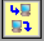
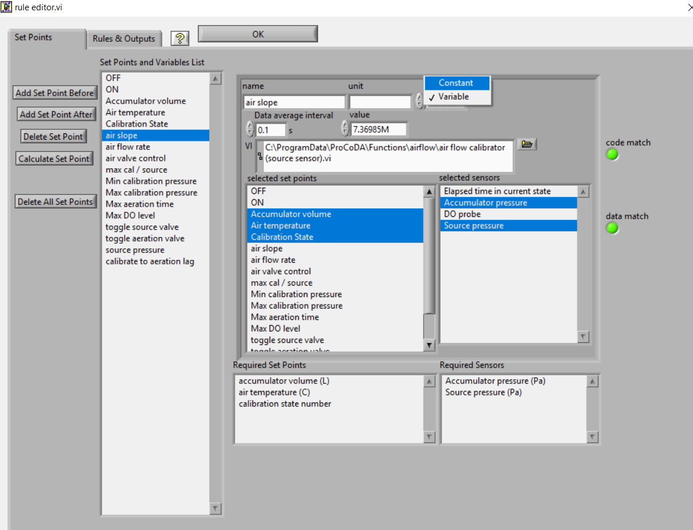

.. _title_Gas_Transfer:

************
Gas Transfer
************

.. _heading_Gas_Transfer_Introduction:

Introduction
============

Exchange of gases between aqueous and gaseous phases is an essential element of many environmental processes. Wastewater treatment plants require enhanced transfer of oxygen into activated sludge tanks to maintain aerobic degradation. Water treatment plants require gas transfer to dissolve chlorine gas or ozone. Gas transfer can also be used to remove unwanted volatile chemicals such as carbon tetrachloride, tetrachloroethylene, trichloroethylene, chloroform, bromodichloromethane, and bromoform from water (Zander et al., 1989). Exchange of a dissolved compound with the atmosphere is controlled by the extent of mixing in the aqueous and gaseous phase, the surface area of the interface, the concentration of the compound in the two phases, and the equilibrium distribution of the compound. Technologies that have been developed to enhance gas transfer include: aeration diffusers, packed-tower air stripping, and membrane stripping. Each of these technologies creates a high interface surface area to enhance gas transfer.

.. _heading_Gas_Transfer_Theory:

Theory
======

Oxygen transfer is important in many environmental systems. Oxygen transfer is controlled by the partial pressure of oxygen in the atmosphere (0.21 atm) and the corresponding equilibrium concentration in water (approximately 10 mg/L). According to Henry's Law, the equilibrium concentration of oxygen in water is proportional to the partial pressure of oxygen in the atmosphere.

.. code:: python
    import aguaclara.research.environmental_processes_analysis as epa
    from aguaclara.core.units import unit_registry as u
    import matplotlib.pyplot as plt
    import numpy as np
    # the code below will eventually be in the AguaClara core and should be called directly

    P_air = 101.3*u.kPa
    temp = np.linspace(0,40)*u.degC
    C_Oxygen = epa.O2_sat(P_air,temp)

    fig, ax = plt.subplots()
    ax.plot(temp,C_Oxygen)
    ax.set(xlabel='Temperature (degrees Celsius)', ylabel='Oxygen concentration (mg/L)')
    fig.savefig('Gas_Transfer/Images/Oxygen_vs_T')
    plt.show()

.. _figure_Oxygen_vs_T:

.. figure:: Images/Oxygen_vs_T.png
    :width: 300px
    :align: center
    :alt: oxygen vs T

    Dissolved oxygen concentrations in equilibrium with the atmosphere.

Natural bodies of water may be either supersaturated or undersaturated with oxygen depending on the relative magnitude of the sources and sinks of oxygen. Algae can be a significant source of oxygen during active photosynthesis and can produce supersaturation. Algae also deplete oxygen levels during the night.

At high levels of supersaturation dissolved gas will form microbubbles that eventually coalesce, rise, and burst at the water surface. The bubbles provide a very efficient transfer of supersaturated dissolved gas to the gaseous phase, a process that can be observed when the partial pressure of carbon dioxide is decreased by opening a carbonated beverage. Bubble formation by supersaturated gasses also occurs in the environment when cold water in equilibrium with the atmosphere is warmed rapidly. The equilibrium dissolved oxygen concentration decreases as the water is warmed (:numref:`figure_Oxygen_vs_T`).

Supersaturation of dissolved gases can also occur when water carrying gas bubbles from a waterfall or spillway plunges into a deep pool. The pressure increases with depth in the pool and gasses carried deep into the pool dissolve in the water. When the water eventually approaches the surface the pressure decreases and the dissolved gases come out of solution and form bubbles. Bubble formation by supersaturated gases can kill fish (similar to the bends in humans) as the bubbles form in the bloodstream.

.. _heading_Gas_Transfer_Coefficient:

Gas Transfer Coefficient
------------------------

The gas transfer rate can be modeled as the product of a driving force (the difference between the equilibrium concentration and the actual concentration) and an overall volumetric gas transfer coefficient (a function of the geometry, mixing levels of the system and the solubility of the compound). In equation form

.. math::
    :label: eq_Gas_first_order

    \frac{dC}{dt} =\hat{k}_{v,l} \left(C^{*} -C\right)

where C is the dissolved gas concentration, C* is the equilibrium dissolved gas concentration, and :math:`\hat{k}_{v,l}` is the overall volumetric gas transfer coefficient . Although :math:`\hat{k}_{v,l}` has dimensions of 1/T, it is a function of the interface surface area (A), the liquid volume (V), the oxygen diffusion coefficient in water (D), and the thickness of the laminar boundary layer (?) through which the gas must diffuse before the much faster turbulent mixing process can disperse the dissolved gas throughout the reactor.

.. math::

    \hat{k}_{v,l} =f(D,\delta ,A,V)

.. _figure_Single_film_model:

.. figure:: Images/Single_film_model.png
    :width: 300px
    :align: center
    :alt: internal figure

    Single film model of interphase mass transfer of oxygen.

The overall volumetric gas transfer coefficient is system specific and thus must be evaluated separately for each system of interest (Weber and Digiano, 1996).

A schematic of the gas transfer process is shown in :numref:`figure_Single_film_model`. Fickian diffusion controls the gas transfer in the laminar boundary layer. The oxygen concentration in the bulk of the fluid is assumed to be homogeneous due to mixing and the oxygen concentration above the liquid is assumed to be that of the atmosphere.

The gas transfer coefficient will increase with the interface area and the diffusion coefficient and will decrease with the reactor volume and the thickness of the boundary layer. The functional form of the relationship is given by

.. math::

    \hat{k}_{v,l} =\frac{AD}{V\delta }

Equation :eq:`eq_Gas_first_order` can be integrated with appropriate initial conditions to obtain the concentration of oxygen as a function of time. However, care must be taken to ensure that the overall volumetric gas transfer coefficient is not a function of the dissolved oxygen concentration. This dependency can occur where air is pumped through diffusers on the bottom of activated sludge tanks. Rising air bubbles are significantly depleted of oxygen as they rise through the activated sludge tank and the extent of oxygen depletion is a function of the concentration of oxygen in the activated sludge. Integrating equation :eq:`eq_Gas_first_order` with initial conditions of C = C0 at t = t0

.. math::

    \int _{C_{0} }^{C}\frac{dC}{C^{*} -C}  =\int _{t_{0} }^{t}\hat{k}_{v,l} dt

.. math::
    :label: eq_Gas_linearized

    \ln \frac{C^{*} -C}{C^{*} -C_{0} } =-\hat{k}_{v,l} (t-t_{0} )

Equation :eq:`eq_Gas_linearized` can be evaluated using linear regression so that :math:`\hat{k}_{v,l}` is the slope of the line.

The simple gas transfer model given in equation :eq:`eq_Gas_linearized` is appropriate when the gas transfer coefficient is independent of the dissolved gas concentration. This requirement can be met in systems where the gas bubbles do not change concentration significantly as they rise through the water column. This condition is met when the water column is shallow, the bubbles have large diameters, or the difference between the concentration of dissolved gas and the equilibrium concentration is small.

.. _heading_Gas_Transfer_Oxygen_Transfer_Efficiency:

Oxygen Transfer Efficiency
--------------------------

An important parameter in the design of aeration systems for the activated sludge process is the energy cost of compressing air to be pumped though diffusers. The pumping costs are a function of the pressure and the airflow rate. The pressure is a function of the hydrostatic pressure (based on the depth of submergence of the diffusers) and the head loss in the pipes and through the diffuser. The required airflow rate is a function of the BOD of the wastewater and the efficiency with which oxygen is transferred from the gas phase to the liquid phase. This oxygen transfer efficiency (OTE) is a function of the type of diffuser, the diffuser depth of submergence, as well as temperature and ionic strength of the activated sludge. Oxygen transfer is a remarkably inefficient process; only a small fraction of the oxygen carried by the rising bubbles diffuses into the activated sludge. The most efficient systems use membrane diffusers and achieve an OTE of approximately 10\%.

The manufacturer typically provides oxygen transfer efficiency for a specific diffuser. In this laboratory we will measure oxygen transfer efficiency for the aeration stone that we will be using in an activated sludge tank. The molar transfer rate of oxygen through the diffuser is

.. math::
    :label: eq_Gas_air_supply

    \dot{n}_{gas\; o_{2} } =\frac{Q_{air} P_{air} f_{O_{2} } }{RT}

where
 | :math:`f_{O_2}` is the molar fraction of air that is oxygen (0.21),
 | :math:`Q_{air}` is the volumetric flow rate of air into the diffuser,
 | :math:`P_{air}` is the air pressure immediately upstream from the diffuser,
 | :math:`R` is the universal gas constant and
 | :math:`T` is absolute temperature.

If the airflow rate is already given with units of moles/s then the molar transfer rate of oxygen can be obtained by multiplying by the molar fraction of air that is oxygen.

The molar rate of dissolution into the aqueous phase is

.. math::

    \dot{n}_{aq\; o_{2} } =\frac{\rlap{-} V}{MW_{O_{2} } } \frac{dC}{dt}

where
 | :math:`MW_{O_2}` is the molecular weight of oxygen,
 | :math:`\rlap{-} V` is the reactor volume, and
 | :math:`\frac{dC}{dt}` is the change in aqueous oxygen concentration with time.

The rate of change of oxygen concentration is a function of the dissolved oxygen concentration and is a maximum when the dissolved oxygen concentration is zero. Oxygen transfer efficiency could be measured for any dissolved oxygen concentration. A better method of analysis is to substitute the right side of equation :eq:`eq_Gas_first_order` for :math:`\frac{dC}{dt}` .

.. math::
    :label: eq_Gas_O2_dissolved

    \dot{n}_{aq\; o_{2} } =\frac{V\hat{k}_{v,l} \left(C^{*} -C\right)}{MW_{O_{2} } }

The oxygen transfer efficiency is the ratio of equation :eq:`eq_Gas_O2_dissolved` to equation :eq:`eq_Gas_air_supply`.

.. math::
    :label: eq_Gas_OTE

    OTE=\frac{\hat{k}_{v,l} \left(C^{*} -C\right)VRT}{MW_{O_{2} } Q_{air} P_{air} f_{O_{2} } }

Measurement of OTE using equation :eq:`eq_Gas_OTE` requires that the gas transfer coefficient, air flow rate, air pressure, and the air temperature be measured. (:math:`P_{air}` and :math:`Q_{air}` have to correlate and in this experiment the best combination is atmospheric pressure and the flow rate given by the pump.)

If the molar airflow rate is controlled then OTE is based on the ratio of equation :eq:`eq_Gas_O2_dissolved` to the molar transfer rate of supplied oxygen.

.. math::
    OTE=\frac{\dot{n}_{aq\; o_{2} } }{f_{O_{2} } \dot{n}_{air} } =\frac{V\hat{k}_{v,l} \left(C^{*} -C\right)}{f_{O_{2} } \dot{n}_{air} MW_{O_{2} } }

.. _heading_Gas_Transfer_Deoxygenation:

Deoxygenation
-------------

To measure the reaeration rate it is necessary to first remove the oxygen from the reactor. This can be accomplished by bubbling the solution with a gas that contains no oxygen. Nitrogen gas is typically used to remove oxygen from laboratory reactors. Alternately, a reductant can be used. Sulfite is a strong reductant that will reduce dissolved oxygen in the presence of a catalyst.

.. math::

    {O}_{{2}} +{2SO}_{{3}}^{-{2}} \stackrel{{cobalt}}{\longrightarrow}{2SO}_{{4}}^{-{2}}

The mass of sodium sulfite required to deoxygenate 1 mg of oxygen is calculated from the stoichiometry of equation :eq:`eq_Gas_first_order`.

.. math::

    \frac{{mole\; O}_{{2}} }{{32000\; mg\; O}_{{2}} } \cdot \frac{{2\; mole\; Na}_{{2}} {SO}_{{3}} }{{mole\; O}_{{2}} } \cdot \frac{{126,000\; mg\; Na}_{{2}} {SO}_{{3}} }{{mole\; Na}_{{2}} {SO}_{{3}} } =\frac{{\; 7.875\; mg\; Na}_{{2}} {SO}_{{3}} }{{mg\; O}_{{2}} }

If complete deoxygenation is desired a 10\% excess of sulfite can be added. The sulfite will continue to react with oxygen as oxygen is transferred into the solution. The oxygen concentration can be measured with a dissolved oxygen probe or can be estimated if the temperature is known and equilibrium with the atmosphere assumed (:numref:`figure_Oxygen_vs_T`).

.. code:: python

  """ importing """
  from aguaclara.core.units import unit_registry as u
  import matplotlib.pyplot as plt
  import numpy as np
  O2_C = np.linspace(0,10,10) * u.mg/u.L
  Sample_V = 750 * u.mL
  SulfiteperO2 = 7.875
  Sulfite_Stock_C = 100 * u.mg/u.mL
  def Sulfite_V(O2_C):
    return (Sample_V*O2_C*SulfiteperO2/Sulfite_Stock_C).to(u.mL)
  fig, ax = plt.subplots()
  ax.plot(O2_C,Sulfite_V(O2_C))
  ax.set(xlabel='Oxygen concentration (mg/L)', ylabel='Sulfite stock volume (mL)')
  ax.grid(color='b', linestyle='-', linewidth=0.5)
  fig.savefig('Gas_Transfer/Images/Sulfite')
  plt.show()

.. _figure_sulfite:

.. figure:: Images/Sulfite.png
    :width: 300px
    :align: center
    :alt: internal figure

    Volume of 100 mg/mL sodium sulfite stock required to deoxygenate a 750 mL sample of water.

.. _heading_Gas_Transfer_Experimental_Objectives:

Experimental Objectives
=======================

The objectives of this lab are to:

 #. Illustrate the dependence of gas transfer on gas flow rate.
 #. Develop a functional relationship between gas flow rate and gas transfer.
 #. Measure the oxygen transfer efficiency of a course bubble diffuser.
 #. Explain the theory and use of dissolved oxygen probes.

A small reactor that meets the conditions of a constant gas transfer coefficient will be used to characterize the dependence of the gas transfer coefficient on the gas flow rate through a simple diffuser. The gas transfer coefficient is a function of the gas flow rate because the interface surface area i.e., the surface area of the air bubbles) increases as the gas flow rate increases.

.. _heading_Gas_Transfer_Dissolved_Oxygen_Probes:

Dissolved Oxygen Probes
=======================

Theory
------

The dissolved oxygen probes make use of the fact that an applied potential of 0.8 V can reduce :math:`O_2` to :math:`H_2O`:

.. math::

    4 e^- + 4 H^+ + O_2 \mathrm{\to} 2 H_2O

The cell is separated from solution by a gas permeable membrane that allows :math:`O_2` to pass through. The concentration of :math:`O_2` in the cell is kept very low by reduction to :math:`H_2O`. The rate at which oxygen diffuses through the gas permeable membrane is proportional to the difference in oxygen concentration across the membrane. The concentration of oxygen in the cell is :math:`\mathrm{\approx}0` and thus the rate at which oxygen diffuses through the membrane is proportional to the oxygen concentration in the solution.

Oxygen is reduced to water at a silver (Ag) cathode of the probe. Oxygen reduction produces a current that is converted to a voltage that is measured by ProCoDA.

.. _heading_Gas_Transfer_Experimental_Methods:

Experimental Methods
====================

The reactors are 1 L beakers that will be filled with 750 mL of water (:numref:`figure_Gas_Schematic`). The DO probe should be placed in a location so as to minimize the risk of air bubbles lodging on the membrane on the bottom of the probe. The aeration stone is connected to a source of regulated air flow. A 200-kPa pressure sensor is used to measure the air pressure in the accumulator.

.. _figure_Gas_Schematic:

.. figure:: Images/Schematic.png
    :width: 600px
    :align: center
    :alt: internal figure

    Apparatus used to measure reaeration rate.

The ProCoDA II software will be used to control the air flow rate for the aeration experiment. The software will use external code to calculate the calibration constant for the flow restriction, to control valve 1 (the air supply valve), and to regulate the flow of air into the accumulator. The calibration uses the ideal gas law to determine the flow rate as a function of the difference in pressure between the source and the accumulator. Once this calibration is obtained a separate code will set the fraction of time that valve 1 needs to be open to obtain the desired flow rate of air into the accumulator.

Initial Setup
-------------

.. |Open_method| image:: ../ProCoDA/Images/Config_open_save_export.png
.. |Logging_data_short_exp| image:: ../ProCoDA/Images/config_Logging_data_short_exp.png
.. |Mode_of_operation| image:: ../ProCoDA/Images/Mode_of_operation.png
.. |Accumulator_pressure_sensor| image:: Images/Accumulator_pressure_sensor.jpg
    :height: 45
.. |config_sensors| image:: ../ProCoDA/Images/config_sensors.png
.. |sensor_set_to_zero| image:: ../ProCoDA/Images/sensor_set_to_zero.png

.. |config_edit_rules| image:: ../ProCoDA/Images/config_edit_rules.png
.. |select_y_axis_scale| image:: Images/select_y_axis_scale.png
.. |air_slope| image:: Images/air_slope.png

.. |config_Logging_data_short_exp| image:: ../ProCoDA/Images/config_Logging_data_short_exp.png

Follow these steps to set up the experiment.

 #. Assemble the apparatus.
 #. Make sure that you push hard and twist to insert tubing into quick connect fittings.
 #. Install the accumulator pressure sensor |Accumulator_pressure_sensor| so that the positive side of the sensor is connected to the accumulator. The positive side of the pressure sensor is the side that is farthest from where the cable is attached to the sensor.
 #. Use the |Open_Method| on the ProCoDA configuration tab (select the left open folder icon) to load the `method file containing the configuration necessary to control airflow <https://github.com/monroews/EnvEngLabTextbook/raw/master/ProCoDA/methods/Gas_Transfer_Student_method_file.pcm>`_.
 #. Plug the pressure sensor that is monitoring the flow accumulator into sensor port 0.
 #. Plug the dissolved oxygen probe into sensor port 1.
 #. Plug the air source valve that is connected to the flow restriction into the port labeled 2 24 V.
 #. Plug the aeration valve that is upstream from the needle valve into the port labeled 3 24 V.
 #. Open the accumulator bottle cap to ensure that it is at atmospheric pressure.
 #. Zero the accumulator pressure sensor by selecting |config_sensors|, select the accumulator pressure sensor and then select |sensor_set_to_zero|.
 #. Close the accumulator bottle cap.
 #. Open the air valve that provides laboratory air to your apparatus and fix any air leaks that you observe.
 #. Close the needle valve (:math:`N_2` in :numref:`figure_Gas_Schematic`) that is closest to the beaker by turning it clockwise.
 #. Navigate to the ProCoDA Process Operation tab.
 #. Set the **operator selected state** to toggle.  The solenoid valves should click rhythmically if they are working properly. You can hold a solenoid valve in your hand to fill it actuating. If it isn't actuating you can test the connection where it is plugged into ProCoDA.
 #. Open the needle valve, :math:`N_2`, so that air pulses gently in your reactor and doesn't spill any water.

Connect to the shared source pressure sensor
--------------------------------------------

 #. Navigate to the ProCoDA configuration tab and click on share data |share_data|.
 #. Browse to the shared S drive (right below the Local Disk C), select the folder "Shared data".
 #. A shared variable called "Source pressure" should be in the tab of "Shared data from other instances of ProCoDA". Select that variable by clicking on it. It will highlight.
 #. Click on OK.
 #. Select the ProCoDA Graph tab.

Check for air leaks
-------------------

 #. Fill the accumulator with air by selecting the "calibrate" state. (You may need to open needle valve :math:`N_1`.)
 #. After the accumulator is at high pressure (approximately 50 kPa or greater), then close all solenoid valves by selecting the "Off" state.
 #. Check your system for air leaks by monitoring the accumulator pressure. If it drops over time, then check each tubing connection and if necessary push hard and twist to properly insert tubing into the quick connect tube fittings. If the pressure increases then the solenoid valve, :math:`S_1`, is leaking and should be replaced.
 #. If the leaking persists then check for other leaks. Possible leak sources include pipe thread connections, rough tubing ends at the instant tube fitting o-ring seal, accumulator cap, or leaking solenoid valves.

Calibrate the air flow controller
---------------------------------

The purpose of this calibration step is to measure the characteristics of the flow resistor so that the rate of flow from the air supply to the flow accumulator can be predicted and controlled. The flow rate from the air source to the flow accumulator is dependent on the air source pressure, the accumulator pressure, and the flow resistance between them. The flow rate decreases as the difference in pressure decreases.

The calibration uses 3 states. The first state is "prepare to calibrate". In this state the aeration valve opens and the accumulator pressure drops until it reaches the "Min calibration pressure (Pa)" which is set at 5,000 Pa. The second state is "calibrate". In this state the aeration valve closes and the air source valve opens. This causes the flow accumulator to rapidly fill. The "calibrate" state ends when the pressure in the accumulator reaches 60% of the source pressure. The next state is a 5 second pause in which both valves are closed. Finally the system switches to aerate and uses the flow rate entered as a variable in |config_edit_rules|. The calibration sequence creates a graph as shown in :numref:`figure_Airflow_calibration_graph`. The data from the "calibrate" state is used to find the unknown term in equation :eq:`eq_t_fill_accumulator`.

.. _figure_Airflow_calibration_graph:

.. figure:: Images/Airflow_calibration_graph.png
    :width: 600px
    :align: center
    :alt: internal figure

    Graph of the airflow calibration. The initial accumulator pressure decrease is during the "prepare to calibrate" state. The accumulator fills rapidly during the "calibrate" state.

Complete the following steps.

 #. Gently close the needle valve that is close to the air supply (:math:`N_1`). Then open the valve about 1/8th of a turn.
 #. Set up the graph in the ProCoDA Graphs tab to look similar to :numref:`figure_Airflow_calibration_graph`. Note that you can select multiple data source for plotting by holding down the control key while clicking on the data to plot.
 #. Set both the Accumulator pressure and the Source Pressure plots to use the same left y axis |select_y_axis_scale|. Select the y axis by clicking on the plot of interest in the legend. This will make it easy to observe how the accumulator is behaving relative to the source pressure.
 #. Set the mode of operation |Mode_of_operation| to automatic operation and the *operator selected state* to "prepare to calibrate". The software should quickly cycle through the calibration step and then begin attempting to control the air flow rate to the target value.  Note:  the purpose of the prepare to calibrate state is to vent excess pressure from the accumulator.  The state will not change to calibrate until the pressure drops below a predefined threshold.  To speed this up, you may open the needle valve.
 #. The air slope should have a value of approximately 1.5 E7 to 2.5 E7. To increase the air slope close the :math:`N_1` needle valve slightly and repeat the "Calibrate" step.
 #. Repeat the "Calibrate" step several times to make sure you understand what ProCoDA is doing and to confirm that the air slope |air_slope| displayed on the ProCoDA "Process Operation" tab is repeatable (within about 5%). Hint: You can tell ProCoDA to go back to "prepare to calibrate" state by right clicking on that state.
 #. Lock the air slope by changing it from a variable to a constant. This will prevent you from accidently losing the air slope by clicking on the calibrate state. Browse to the ProCoDA "Configuration" tab, select |config_edit_rules|, select the variable "air slope", and change it to a constant.  |Change_air_slope_to_constant|
 #. Don't adjust the :math:`N_1` needle valve now that the air flow is calibrated.

Test the air flow controller
----------------------------

In the following test, the air flow controller should provide a constant flow of air into the accumulator. You can assess how well the air flow controller is working based on the slope of the pressure as a function of time. The equation for the expected change in pressure vs time can be derived from the ideal gas law.

.. math::

    PV = nRT

    P = \frac{nRT}{V}

    \Delta P = \frac{\dot{n}RT}{V}\Delta t

    P = P_{0} + \Delta P = P_{0} +\frac{\dot{n}RT}{V}\Delta t

This equation has been programming in ProCoDA as the "air fill model". Thus you can compare the measured pressure in the accumulator and the "air fill model" to see if the flow controller is working properly.

 #. Add the "air fill model" to the ProCoDA graph and make sure that it is using the left axis.
 #. Set the air flow rate based on our calibration be navigating to the Configuration tab and selecting |config_edit_rules|. We want to control the air flow rate, so select air flow rate from the set points and variables list. Set the air flow rate to a value of 400u (400 :math:`\mu M/s`).
 #. Begin logging data at a 1 s interval using the |config_Logging_data_short_exp| datalog button on the configuration tab. Data is being logged when the icon is green.
 #. Set the **operator selected state** to "Prepare to test fill"
 #. Watch the graph to see the accumulator pressure and air fill model increase at the same rate (hopefully).
 #. End logging data when the fill cycle ends.
 #. The resulting graph should look like the figure below.
 #. The measured value for the final pressure at the end of the "Fill accumulator" state should be within 20% of the predicted value. You can find these values in the data log.

.. _figure_Accumulator_fill:

.. figure:: Images/Accumulator_fill.png
   :width: 600px
   :align: center
   :alt: ProCoDA graph of the accumulator filling

   Graph of the accumulator filling at a flow rate of 100 :math:`\mu M/s`. The measured values and the model are in reasonable agreement.

Install the Membrane Cap on the Dissolved Oxygen Probe
------------------------------------------------------

 #. Make sure to wear gloves for these steps!
 #. Use a pipette or dropper to fill the membrane cap with 0.05 N NaOH solution. Take care not to dispense air bubbles into the membrane cap. Fill the cap to within 5 mm of the top.
 #. Place a beaker on the bench top below the membrane cap to catch any spilled NaOH solution.
 #. Hold the cap so that it doesn't spill and screw the probe into the cap. Some NaOH will leak out as you tighten the cap. Catch these drips in the beaker.
 #. Rinse the probe with deionized water.
 #. Inspect the probe carefully to see if there are any air bubbles inside the membrane. If there are any bubbles, repeat starting at step 2.

Calibrate the Dissolved Oxygen Probe
------------------------------------

 #. Add 750 mL of tap water to the reactor.
 #. The instructor or TA will add :math:`10\frac{ \mu g}{L}` of :math:`CoCl_2 \cdot 6H_2O` (note this only needs to be added once because it is the catalyst). A stock solution of :math:`100 \mu g/mL` of :math:`CoCl_2 \cdot 6H_2O` (thus add 75 :math:`\mu L` per 750 mL) has been prepared to facilitate measurement of small cobalt doses. (Use gloves when handling cobalt!)
 #. :ref:`Calibrate the DO probe <heading_ProCoDA_Dissolved_Oxygen>`. Use :math:`22^{\circ}C` as the temperature.

Measure the Gas Transfer
------------------------

:numref:`table_air_flow_rates` provides the air flow rates for each team. The data will be consolidated

.. _table_air_flow_rates:

.. csv-table:: Suggested flow rates.
   :header: Group	Flows, (:math:`\mu M/s`)
   :align: center

   Group 1, "100, 400, 700"
   Group 2,	"125, 425, 725"
   Group 3,	"150, 450, 750"
   Group 4,	"175, 475, 775"
   Group 5,	"200, 500, 800"
   Group 6,	"225, 525, 825"
   Group 7,	"250, 550, 850"
   Group 8,	"275, 575, 875"
   Group 9,	"300, 600, 900"
   Group 10,	"325, 625, 925"
   Group 11,	"350, 650, 950"
   Group 12,	"375, 675, 975"

Set the stirrer speed to mix the tank but not to cause a vortex that sucks bubbles into the stirrer. Then repeat the following steps for each flow rate.
 #. Set the air flow rate in |config_edit_rules| to the desired flow rate.
 #. Set the **operator selected state** to aerate.
 #. Set the needle valve that is close to the beaker, :math:`N_2`, so the pressure in the accumulator is between 20 and 50 kPa.
 #. Wait until the accumulator pressure reaches steady state.
 #. Turn the air off by changing the operator selected state to OFF.
 #. Add enough sodium sulfite to deoxygenate the solution. It is okay if the sample doesn't completely deoxygenate. The goal is to have less than 1.5 mg/L of oxygen at the beginning of the aeration. A stock solution of sodium sulfite (100 mg/mL) has been prepared to facilitate measurement of small sulfite doses. Calculate this dose based on the measured dissolved oxygen concentration. (see :numref:`figure_sulfite`)
 #. Prepare to record the dissolved oxygen concentration using ProCoDA software. Use 5-second data intervals and log the data to ``S:\Courses\4530\Group #\gastran\x`` where x is the flow rate in :math:`\mu M/s` for later analysis. Include the actual flow rate in the file name.
 #. Turn the air on by changing the **operator selected state** to Aerate.
 #. Monitor the dissolved oxygen concentration until it reaches 50\% of saturation value or 10 minutes (whichever is shorter).
 #. Repeat steps 1-9 to collect data from at least two additional flow rates.
 #. email your data files (correctly named!) to the course email account.
 #. Answer the questions in the section on :ref:`heading_Gas_Transfer_Lab_Explorations`.

.. _heading_Gas_Transfer_Lab_Explorations:

Lab Explorations
================

This lab exercise introduces the use of computer control as well as some interesting hydraulics. These questions are designed to help you think through everything that is happening in this lab. Include a discussion of these questions in the laboratory report.

The ProCoDA method that you used in this lab has two programs that cause ProCoDA to switch between states and change what it is doing. Explore the rule editor, |config_edit_rules|, to figure out answers to the following questions.

#. Under what condition does ProCoDA switch from the "prepare to calibrate" state to the "calibrate" state?
#. Under what condition does ProCoDA switch from the "calibrate" state to the "Pause" state?
#. How does the "Pause" state know which state to go to next?
#. What is the equation that is used to calculate the maximum calibration pressure and why is this equation better than using a constant for the maximum calibration pressure?
#. Explain how ProCoDA calculates the predicted pressure in the accumulator when it is filled at a constant mass flow rate.
#. What are the inputs to the "air valve control"?
#. What does "air valve control" control and which two states use it?
#. Write a ProCoDA program that cycles between two states that aerate for 15 s and then pause for 10 s. Show the TA!

.. _heading_Gas_Transfer_Pre-Laboratory_Questions:

Prelab Questions
================

 #. Calculate the mass of sodium sulfite needed to reduce all the dissolved oxygen in 750 mL of pure water in equilibrium with the atmosphere and at :math:`22^\circ C`.
 #. Describe your expectations for dissolved oxygen concentration as a function of time during a reaeration experiment.  Assume you have added enough sodium sulfite to consume all of the oxygen at the start of the experiment. What would the shape of the curve look like?
 #. Why is :math:`\hat{k}_{v,l}` not zero when the gas flow rate is zero? How can oxygen transfer into the reactor even when no air is pumped into the diffuser?
 #. Describe your expectations for :math:`\hat{k}_{v,l}` as a function of gas flow rate. Do you expect a straight line? Why?
 #. A dissolved oxygen probe was placed in a small vial in such a way that the vial was sealed. The water in the vial was sterile. Over a period of several hours the dissolved oxygen concentration gradually decreased to zero. Why? (You need to know how dissolved oxygen probes work!)

.. _heading_Gas_Transfer_Data_Analysis:

Data Analysis
=============

This lab will use the power of python to streamline repetitive data analysis. Use the data from the entire class for the analysis. You can use for loops to cycle through all of the data sets.

 #. Eliminate the data from each data set when the dissolved oxygen concentration was less than 2 mg/L. This will ensure that all of the sulfite has reacted. Also remove the data when the dissolved oxygen concentration was greater than 6 mg/L to reduce the effect of measurement errors when the oxygen deficit is small.
 #. Plot a representative subset of the data showing dissolved oxygen vs. time. Perhaps show 5 plots on one graph.
 #. Calculate :math:`C^{\star}` based on the average water temperature, barometric pressure, and the equation from `environmental processes <https://github.com/AguaClara/aguaclara/blob/master/aguaclara/research/environmental_processes_analysis.py>`_ analysis called O2_sat. :math:`C^{\star} =P_{O_{2}} {\mathop{e}\nolimits^{\left(\frac{1727}{T} -2.105\right)}}` where T is in Kelvin, :math:`P_{O_{2} }` is the partial pressure of oxygen in atmospheres, and :math:`C^{\star}` is in mg/L.
 #.  Estimate :math:`\hat{k}_{v,l}` using linear regression and equation :eq:`eq_Gas_linearized` for each data set.
 #. Create a graph with a representative plot showing the model curve (as a smooth curve) and the data from one experiment. You will need to derive the equation for the concentration of oxygen as a function of time based on equation :eq:`eq_Gas_linearized`.
 #. Plot :math:`\hat{k}_{v,l}` as a function of airflow rate (:math:`\mu mole/s`).
 #. Plot OTE as a function of airflow rate (?mole/s) with the oxygen deficit (:math:`C^{\star} -C`) set at 6 mg/L.
 #. Comment on the oxygen transfer efficiency and the trend or trends that you observe.
 #. Propose a change to the experimental apparatus that would increase the efficiency.
 #. Verify that your report and graphs meet the requirements.

.. _heading_Gas_Transfer_References:

References
==========

 Weber, W. J. J. and F. A. Digiano. 1996. Process Dynamics in Environmental Systems. New York, John Wiley \& Sons, Inc.Zander, A. K.; M. J. Semmens and R. M. Narbaitz. 1989. **Removing VOCs by membrane stripping** American Water Works Association Journal 81: 76-81.

.. _heading_Gas_Transfer_Lab_Prep_Notes:

Lab Prep Notes
==============

.. _table_Gas_reagent_list:

.. csv-table:: Reagent list.
    :header: Description,	Supplier,	Catalog number, Concentration
    :widths: 20, 20, 10,10
    :align: center

    :math:`Na_2SO_3`, Fisher Scientific, S430-500, 100 g/L
    :math:`CoCl_2 \cdot 6H_2O`, Fisher Scientific, C371-100, 100 mg/L
    :math:`NaOH`, VWR, pending, 0.05 N = 2 g/L

Setup
-----

 #. Prepare the sodium sulfite immediately before class and distribute to groups in 15 mL PP bottles to minimize oxygen dissolution and reaction with the sulfite.
 #. The cobalt solution can be prepared anytime and stored long term.
 #. Install the membranes on the DO probes and confirm that all probes are operational.
 #. Provide clamps to mount DO probes on magnetic stirrers.
 #. Determine maximum airflow rate that is reasonable given small reactor volume.
 #. Configure the TA workstation to be measuring the source air pressure and sharing it using this `ProCoDA method <https://github.com/monroews/EnvEngLabTextbook/raw/master/ProCoDA/methods/Gas_Transfer_TAbench_method_file.pcm>`_.
 #. Verify that the source air pressure is close to 100 kPa. If it exceeds 120 kPa then ask the building manager to reduce the air pressure.

Clean up
========

#. DO Probe: unscrew the cap from the probe and wash the electrodes core (cathode: platinum, anode: lead) and the cap with deionized water. Dry all the components with tissue. Screw the cap back to the probe without adding any filling solution to prevent the anode from being consumed. Put all the components back into the package.
#. Pore water used for aeration into container designated by the TA. We collect this water because of the cobalt contamination.
#. Do **not disassemble the aeration system**. Rinse it, dry it and keep it as one unit and place in storage at your workstation.

.. _heading_Gas_Transfer_Airflow_Control:

Airflow Control
===============

The ProCoDA software can be configured to control the flow of air into the reactor. The hardware required is shown in :numref:`figure_Gas_Schematic`. The control algorithm is based on the theoretical relationship between head loss and flow rate for the air flowing into the accumulator. We can empirically measure the head loss coefficient and then use the theoretical relationship to determine what fraction of time the influent valve should be open to obtain the desired flow rate. We can use the change in pressure in the accumulator when the influent valve is open to determine how fast air was flowing into the accumulator. In order to develop an appropriate head loss model we need to know if the flow into the accumulator is laminar or turbulent.

.. math::
    :label: eq_Gas_Re

    {Re}=\frac{\rho VD}{\mu }

.. math::

    {Re}=\frac{4\rho Q}{\pi d\mu }

If we hold pressure and temperature constant and then take the derivative of the ideal gas law we obtain.

.. math::

    P\rlap{--}\dot{V}=\dot{n}RT

and since change in volume with respect to time is a flow rate we have

.. math::
    :label: eq_Gas_Qair

    Q=\frac{\dot{n}RT}{P}

Density of an ideal gas is given by

.. math::
    :label: eq_Gas_density

    \rho =\frac{PM_{gas} }{RT}

Substituting these relationships into equation :eq:`eq_Gas_Re` for Reynolds number we obtain

.. math::

    {Re}=\frac{4\dot{n}M_{gas} }{\pi d\mu }

For the air flow controller used in the lab the following values are obtained

 :math:`\dot{n}` max flow is about 10,000 :math:`\mu M/s` :math:`M_{gas}` is 0.029 kg/M, and :math:`\mu` is :math:`1.8 x 10^{-5} Ns/m^2`.

.. math::

    {Re}=\frac{4\left(10000\times 10^{-6} \frac{M}{s} \right)\left(0.029\frac{kg}{M} \right)}{\pi \left(1\times 10^{-3} m\right)\left(1.8\times 10^{-5} \frac{N\cdot s}{m^{2} } \right)} =20,500

The flow into the air accumulator will almost certainly be turbulent. In any case, we can use the turbulent flow equations for minor losses to describe head loss. The equation for minor losses is:

.. math::
    :label: eq_Gas_minor_losses

    h_{minor} =K\frac{8Q^{2} }{g\pi ^{2} D^{4} }

To use equation :eq:`eq_Gas_minor_losses` for air we substitute pressure change for :math:`h_{minor}`, equation :eq:`eq_Gas_Qair` for flow rate, and equation :eq:`eq_Gas_density` for density.

.. math::
    :label: eq_Gas_minor_losses_for_gas

    \Delta p=K\frac{8M_{gas} RT\dot{n}^{2} }{\pi ^{2} D^{4} P}

This change of pressure is occurring between the air supply and the accumulator. The pressure, P, in equation :eq:`eq_Gas_minor_losses_for_gas` helps determine the velocity of the air and thus head loss is a function of the pressure. The pressure varies between the pressure of the lab air supply, :math:`P_s`, and the pressure in the air accumulator, :math:`P_a`. As a reasonable first approximation we use the average pressure of the supply and the accumulator for P, the difference in pressure for :math:`\Delta p`, and solve equation :eq:`eq_Gas_minor_losses_for_gas` for the molar flow rate.

.. math::
    :label: eq_Gas_molar_flow_of_air

    \dot{n}=\frac{\pi D^{2} }{4\sqrt{KM_{gas} RT} } \sqrt{\left(P_{s} -P_{a} \right)\left(P_{s} +P_{a} \right)}

where :math:`\dot{n}` is the molar flow rate.

Multiplying terms and noting that the supply pressure is relatively constant, but that the accumulator pressure varies as it charges according to the ideal gas law we obtain.

.. math::

    \frac{dn}{dt} =\frac{\pi D^{2} }{4\sqrt{KM_{gas} RT} } \sqrt{P_{s}^{2} -\frac{n^{2} R^{2} T^{2} }{V^{2} } }

Separating terms and integrating from an initial condition with :math:`n_0` moles to a final condition with :math:`n` moles in the accumulator.

.. math::

    \frac{\rlap{--}V}{RT} \int _{n_{0} }^{n }\frac{dn}{\sqrt{\frac{P_{s}^{2} V^{2} }{R^{2} T^{2} } -n^{2} } }  =\int _{0}^{t}\frac{\pi D^{2} }{4\sqrt{KM_{gas} RT} } dt

After integrating we obtain the following equation.

.. math::

    \frac{\rlap{--}V}{RT} \left(\sin ^{-1} \frac{n RT}{P_{s} V} -\sin ^{-1} \frac{n_{0} RT}{P_{s} V} \right)=\frac{\pi D^{2} t}{4\sqrt{KM_{gas} RT} }

.. math::

    t=\frac{4\sqrt{KM_{gas} RT} }{\pi D^{2} } \left(\sin ^{-1} \frac{n RT}{P_{s} V} -\sin ^{-1} \frac{n_{0} RT}{P_{s} V} \right)\frac{\rlap{--}V}{RT}

Since we will be measuring the pressure in the accumulator we can now substitute that pressure for the terms containing moles of air to obtain an equation that is in a linear form such that a single term containing K and D can be obtained by linear regression.

.. math::
    :label: eq_t_fill_accumulator

    t=\frac{4\sqrt{KM_{gas} RT} }{\pi D^{2} } \left(\sin ^{-1} \frac{P_{a } }{P_{s} } -\sin ^{-1} \frac{P_{a_{0} } }{P_{s} } \right)\frac{\rlap{--}V}{RT}

Taking a data set obtained by filling the accumulator, finding the unknown term :math:`\frac{4\sqrt{KM_{gas} RT} }{\pi D^{2} }` by linear regression and then plotting the resulting model next to the data we obtain :numref:`figure_Airflow_controller_calibration`.

.. _figure_Airflow_controller_calibration:

.. figure:: Images/Airflow_controller_calibration.png
    :width: 300px
    :align: center
    :alt: airflow controller calibration

    The model describing the filling of the accumulator fits the data very well.

The final step is to calculate the fraction of time that the valve must be open in order to obtain a desired flow rate into the accumulator. Take the target air flow rate :math:`\dot{n}_{target}` and divide by the molar flow rate given by equation :eq:`eq_Gas_molar_flow_of_air` to get the fraction of time the valve must be open to get the desired average flow rate.

.. math::
    :label: eq_Gas_fvalve

    f_{valve} =\frac{\dot{n}_{t\arg et} }{\dot{n}} =\frac{\dot{n}_{t\arg et} }{\frac{\pi D^{2} }{4\sqrt{KM_{gas} RT} } \sqrt{P_{s}^{2} -P_{a}^{2} } }

Equation :eq:`eq_Gas_fvalve` assumes that inertial effects during flow startup are not significant. Application of equation :eq:`eq_Gas_fvalve` results in slightly more air being delivered than requested. The reason for this error is that when the valve is closed the volume between the location of the head loss and the valve fills to the pressure of the source. This volume of air quickly discharges through the valve as soon as the valve is opened. This error can be minimized by using small valves and by keeping the head loss orifice as close to the valve as possible.

Equation :eq:`eq_Gas_fvalve` is used by the air flow control.vi to calculate the fraction of time that the valve should be open. The ability of the control algorithm to create a desired flow rate can be measured by setting the flow rate and closing the effluent valves from the accumulator. The result is that the accumulator will gradually fill and as it fills :math:`f_{valve}` will gradually increase so the flow rate into the accumulator remains constant. The slope of the pressure vs. time line is proportional to the flow rate.
