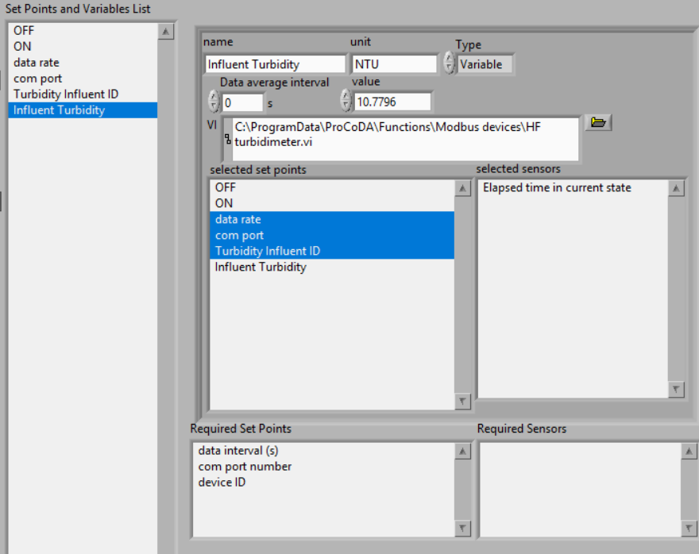
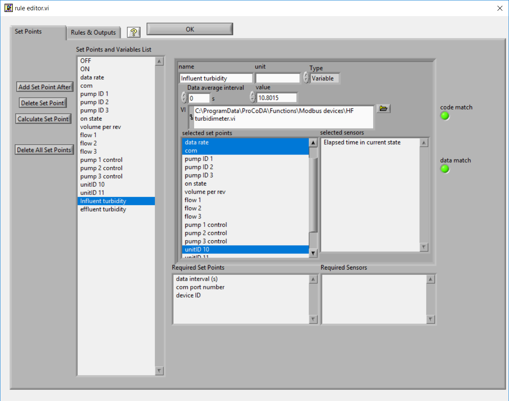
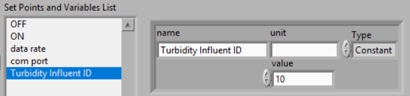
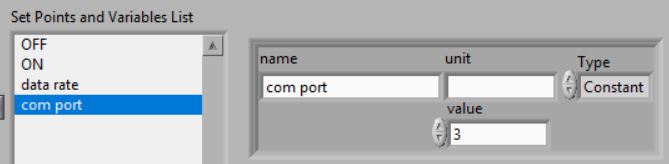

.. _title_ProCoDA:

*********************************************
ProCoDA: Process Control and Data Acquisition
*********************************************

Abstract
========

ProCoDA is easily configured process control and data acquisition software and hardware that significantly enhances experimental evaluation of unit processes and that permits fully automated parametric studies. The process control software is a LabVIEW executable and incorporates sensors, states, rules, an external microprocessor for controls, the ability to link to external LabVIEW code to add new features, and data logging. The composite system is flexible and user friendly. First year undergraduates have used the software to control a bench top drinking water treatment plant and both undergraduate and graduate students have used the software to conduct parametric studies of methane generation, the activated sludge process, flocculation, and porous media filtration. The system offers the user the ability to program an entire series of experimental runs including variation of a parameter over a series of values and inclusion of replicate tests to confirm repeatability of the results. The automated parametric testing has greatly increased our ability to study the response of complex systems. Evaluation of colloidal particle flocculation and porous media filtration in bench-scale experiments are presented here as example applications of the ProCoDA software.

Introduction
============

Process control is commonly used in undergraduate teaching laboratories in electrical and mechanical engineering with an emphasis on the PID (proportional, derivative, integral) control algorithm (Braatz and Johnson, 1998). Process control laboratory experiences typically focus on control of a single parameter such as flow rate, temperature, liquid level, pressure (Rehg et al., 1999), or motor angular velocity (Choi, 2004). Control of real processes generally requires integration of individual process control components into a larger system that includes data acquisition and data logging, as well as the concepts of process state and operating rules. Although researchers have frequently created customized process control code for specific applications ProCoDA is a highly configurable system that can be used to automate the control of parametric experiments or complex processes.

Experimental work is often characterized by repetitive experiments and the need for an individual to configure each of those experiments and then measure and record the data. In the case of engineered environmental systems we are often interested in optimizing the performance of unit processes and exploring the response of processes to a range of inputs. It is often necessary to cycle a selected process through a sequence of operational stages or states, to change process related variables, and to subject the process to a range of inputs. For example, operation of porous media filtration requires implementation of backwash, optional pretreatment, and particle challenge states. Filtration process variables might include flow velocities or the duration of a state, and inputs might include variation in the type and concentration of colloidal particles or coagulant type and dose. In conventional jar tests an experimenter would evaluate flocculation efficiency based on the turbidity of settled water or measure the critical sedimentation velocity by taking a batch sample of the flocs and measuring the turbidity as the sample settles. The measurement of settled water turbidity requires first loading the sample vial with flocs, then measuring turbidity as the flocs settle, and finally purging the sample vial with clean water. Although the states to control porous media filtration and to measure the effectiveness of flocculation could be implemented by a human operator, they are well suited for automation.

We have taken the automation components that are commonly used to control industrial and municipal processes and adapted them for use in the laboratory. Our objective was to create process control software that was highly configurable and link it to sensors and outputs for control. The ProCoDA software began as data acquisition software capable of remote monitoring of experiments with easily configured sensors. The ability to control on/off devices (valves, pumps, mixers, etc.) and the ability to control continuously variable devices such as a variable flow peristaltic pumps was then added. The process control and data acquisition components were integrated and a user friendly programming environment that is highly configurable was created that incorporates the concepts of states, rules, constants, variables, and customizable external functions.

The guiding principle in developing the ProCoDA code was to create an application that was general and easily configured to handle a wide variety of challenges. Thus the code is not designed for a particular unit process. The goal of designing code that was highly adaptable required implementing features that make it possible for users to customize the software for specific tasks. The ProCoDA software includes a built in programming environment for defining variables, constants, and sensors and for writing the logic that controls moving from one process state to the next. To extend the capabilities of the software without making the interface overly complex the ability to use external code to define new functions was added. Examples of external code that we have used to extend the capabilities of the ProCoDA software include proportional integral derivative control algorithms, acquisition of data from turbidimeters and electronic balances over USB ports, functions that incrementally vary a parameter over a specified range and functions that take a flow rate and tubing size and calculate the peristaltic pump speed.

The ProCoDA software was written using LabVIEW. The high level predefined functions, the ease of developing graphical user interfaces, and the integration with input and output devices made LabVIEW the preferred programming environment. In addition to the software we designed hardware interfaces to simplify the use of sensors and controls.

The ProCoDA software runs five parallel processes during normal operation. The five processes are:

  #. Data acquisition from the ProCoDA hardware
  #. Calculation of output values, processing of rules to determine state changes, sending commands to the ProCoDA hardware, and logging of state changes and the rule that caused the state to change
  #. Data logging of sensor data as well as all user defined variables
  #. Graphical display of all sensor data as well as all user defined variables
  #. An event loop that responds to 20 user events to initiate processes such as sensor configuration, rule editing, pump calibration, and hardware selection.

The parallel processes are asynchronous and share data through the use of code objects (LabVIEW SubVIs) that contain both data and methods.

A core feature of the ProCoDA software is the user programmable feature that facilitates customization of the control logic for specific tasks. The rule editor provides a programming environment for setting up states, control logic, set points, variables defined by links to external code, and selecting which user defined parameter controls each output in each state.

Sensor signal wires and power supply connections have been integrated in a single cable to make sensors easy to use in a student laboratory environment. The sensors use a standardized wiring scheme so that a variety of sensors can be used in a connect-calibrate-measure approach. The elimination of power supplies at each experiment location and all of the associated wiring has made sensor use easy for students. The process control software interface for sensors allows adding and configuring sensors while simultaneously collecting data.

The ProCoDA hardware/software can vary the state of on/off devices as well as control devices that require a 4-20 mA signal. The on/off outputs are 24 V with sufficient current to operate small solenoid valves or to switch relays for controlling the power to any number of devices. The 4-20 mA analog outputs are used to control peristaltic pumps. External code is already provided for communication with digital devices including HF scientific turbidimeters, HF scientific AccUView UV meter. We expect to add external code to control digital peristaltic pumps in the near future.

ProCoDA software allows the user to automate data collection and to control many parts of the experimental apparatus. This enables researchers to focus on experimental design and data analysis. Process control software can control the speed of peristaltic pumps, regulate flow through solenoid valves, and measure (or control with feedback) water quality parameters such as temperature, pressure, and dissolved oxygen.

The ProCoDA software is designed to allow complete automation of experiments including running a series of tests where a parameter is adjusted to a different value for each test. ProCoDA is a state machine. That means that you can create a series of states. Each state has it's own logic for which state to go to next and what to do while in that state. A simple example of a state machine is a washing machine. Washing machine states could include

.. _table_ProCoDA_washing_machine_states:

.. csv-table:: Washing machine states
   :header: "State", "What it does", "Exit rule"
   :widths: 5, 10, 10
   :align: center

   Fill, Fills tub with selected amount of water at the requested temperature, Switch to *Agitate* state when pressure sensor reaches target value
   Agitate, Agitate to clean clothing, Switch to *Spin to remove dirty water* after target time is reached
   Spin to remove dirty water, open drain and spin, Switch to *Rinse* after target time is reached
   Rinse, Add water to target level while agitating, Switch to *Spin dry* when target time is reached.
   Spin dry, Spin and drain water, Switch to *off* when target time is reached.

- Setpoints: There are two types of setpoints in ProCoDA, constants and variables. These are the numbers that ProCoDA uses to run any of its functions (These are things like warm or cold water temperatures)
- States: States are the different ways ProCoDA can run (These are the steps of a laundry cycle like agitate, rinse, spin)
- Rules: These control when ProCoDA changes between states (These are like going from rinse to spin)

General Notes
-------------

- When you input a value that it a decimal it will convert it into a form without the decimal (i.e. 0.3 will become 300m)
- The default unit of time is seconds and we recommend using seconds consistently.
- ProCoDA doesn't actually use units internally. The units are only used for documentation. It is the users responsibility to make sure that you are using a consistent set of units.
- The required set points give the order of the set points and the set points must be in the same order when you input them. The set points do not need to be contiguous! They just need to be in the correct order.
- All added set points should be added after ON and OFF,
- As a general rule, add new set points and states at the bottom of the list using add after. This is because ProCoDA only tracks set points and states as elements in an array and thus if the array elements are shifted ProCoDA will refer to the wrong element.

.. |ProCoDA_ports| image:: Images/ProCoDA_ports.png

The hardware consists of box with a National Instruments data acquisition board that connects to the computer via a USB port. The box has 12 ports.
|ProCoDA_ports|

 #. pump 0 and 1: Ports that control on/off, direction, and speed of peristaltic pumps. The on/off and direction controls are based on digital outputs from the data acquisition board. The speed control uses an analog output from the data acquisition board that is converted into a 4-20 mA signal.
 #. sensor 0 to 3 measure voltages from sensors. The ports also contain +5V, -5V, +10V, +15V, -15V power supplies that are used to power sensors (pressure, photometer) or is used to power signal conditioning circuits that are required by some sensors (pH, dissolved oxygen, temperature, photometer).
 #. 24V 2 to 7 provide 24 volt outputs that can be used to power solenoid valves or relays that can then power larger electrical loads.

The distinction between **inputs and outputs** is **critical**. The pump and 24V ports are all outputs. They **control devices**. The sensor ports are inputs that are used to **measure**. Don't plug sensors into outputs! Don't plug pumps into 24 volt ports or into sensors! Don't plug solenoid valves into pump or sensor ports! Don't confuse in and out!

The software combines 3 elements: sensors (inputs from the real world), set points (inputs from the plant operator and calculated values based on sensors and other set points), and logic (rules that govern how the plant should operate given the sensor data and set points). The software contains a graphical user interface where you can edit, save, and open files containing sensor information and files containing the set point and logic information.

Data Acquisition
================

The ProCoDA software is designed to receive data from two types of digital sources. Sensors or meters that have their own digital communication interface can transmit their data to the ProCoDA software through external code that is written specifically for each meter. For example this method is used to acquire data from HF Scientific turbidimeters. Sensors that can be configured to produce an analog voltage such as pressure, pH and dissolved oxygen are monitored with a National Instruments USB data acquisition board.

Sensors are wired using Category 5 or 6 Ethernet cable using our own :ref:`analog <table_ProCoDA_sensor_wiring>` wiring standard. Two wires are used to carry the sensor output voltage designated as S- and S+. Five wires are used for different voltage power supplies, and one wire is used for the power supply ground. Sensors are wired to connect to the power supply that they require. Thus, the sensor is powered and monitored through a single port. This scheme is used for a variety of sensors including pressure, strain gage, pH, dissolved oxygen, photometer, and temperature. For several of the sensors the power supplies are also used to power a signal conditioning circuit to transform the sensor output into a voltage that can easily be monitored with a data acquisition system.

.. _table_ProCoDA_sensor_wiring:

.. csv-table:: Wiring standard used for combining power supplies and analog data acquisition in a Category 5 Ethernet cable
   :header: T-568B standard, T-568A standard, voltage
   :widths: 20, 20, 20
   :align: center

   white/orange,	white/green,	S-
   white/green,	white/orange,	ground
   white/brown,	white/brown,	-15 V
   white/blue,	white/blue,	+5 V
   orange,	green,	S+
   green,	orange,	+10 V
   brown,	brown,	+15V
   blue,	blue,	-5 V

.. _heading_ProCoDA_Configure:

Configure
=========

.. |config_calibrate_pump| image:: Images/config_calibrate_pump.png
.. |config_DAQ| image:: Images/config_DAQ.png
.. |config_data_state_log| image:: Images/config_data_state_log.png
.. |config_edit_rules| image:: Images/config_edit_rules.png
.. |config_Logging_data_short_exp| image:: Images/config_Logging_data_short_exp.png
.. |Config_open_save_export| image:: Images/Config_open_save_export.png
.. |config_samples_per_read| image:: Images/config_samples_per_read.png
.. |config_select_daq| image:: Images/config_select_daq.png
.. |config_sensors| image:: Images/config_sensors.png
.. |config_share_data| image:: Images/config_share_data.png

The configure tab of ProCoDA is used to select the ProCoDA box that will be controlled by the software. It is possible to connect more than one ProCoDA box to a single computer and have multiple instances of the ProCoDA software running at the same time. But that is a capability that we haven't truly tested and most users want to control a single experiment with one ProCoDA box.

Select the |config_select_daq| to select the ProCoDA box and to configure the data acquisition.  |config_DAQ| The available analog input (AI) channels (for sensors) are displayed along with the maximum voltage that can be measured. Most of our sensors have an output voltage of less than 1 volt and thus the maximum voltage can be set to 1 volt. The exception is the photometer that has an output maximum voltage of 5 V.

ProCoDA keeps a small amount of data in memory at all time that can be used for making decisions. This is critical because sensors area always noisy and thus it is poor practice to make decisions based on instantaneous measurements. Instead we use an average of recent data and select the amount of averaging based on the requirements for the control system. The length (in seconds) of the data record that is available in the buffer is set by the size of the buffer and the rate of sampling. The highest rate of sampling is 2500 Hz. We recommend that sampling be as fast as possible and that data averaging be used to smooth the data.

Data averaging is implemented by pressing the spacebar and then editing the number of samples per read. In the example below we have set samples per read to 10. In this case the data is read at 250 Hz in 10 sample chunks. Each chunk of 10 samples is averaged on its way into the ProCoDA program. Thus the data is smoothed and results in less noisy signals.
|config_samples_per_read|

The ProCoDA circuitry that sets the peristaltic pump speed can be calibrated (in software) with |config_calibrate_pump|. This calibration ensures that the pump actually rotates at the speed set by ProCoDA. This calibration only needs to be done once for each pump that is controlled.

ProCoDA has the ability to access data from other ProCoDA software on other computers if there is a shared server where the data can be shared. This data sharing |config_share_data| makes it possible for multiple users to have access to data that is being logged at one location. In the AguaClara laboratory researchers can access the laboratory water temperature using this system. In the Environmental Engineering teaching laboratory this feature is used to enable all of the workstations to access the pressure of the air supply that is used for the gas transfer experiments.

.. _heading_ProCoDA_Methods:

Methods
-------

ProCoDA is highly configurable (it is after all, a friendly programming environment for laboratory automation) and those configurations or methods are saved in files. ProCoDA automatically saves ALL changes in configuration as they happen in ``C:\ProCoDA Data\ProCoDA 0.pcm`` where the integer refers to the instance of the ProCoDA software if multiple instances are being used. This method file is automatically loaded when ProCoDA is launched. Very occasionally ProCoDA crashes and creates a corrupted method file and thus refuses to launch properly. In that case simply delete this file.

Given that ProCoDA automatically saves the method file that means that any mistakes in editing are immediately saved as well. To safeguard against this ProCoDA also saves a copy of the method file in the folder location where the data is being logged. We recommend that copies of the ProCoDA method also be saved in a secure location by the researcher as a third level of safety. Use the |Config_open_save_export| buttons to save the current method, retrieve a method from file, or export the method in a tab delimited file in a human readable format.

.. _heading_ProCoDA_Sensors:

Sensors |config_sensors|
========================

.. |sensor_clear_offsets| image:: Images/sensor_clear_offsets.png
.. |sensor_copy| image:: Images/sensor_copy.png
.. |sensor_delete| image:: Images/sensor_delete.png
.. |sensor_DO| image:: Images/sensor_DO.png
.. |sensor_edit_calibration| image:: Images/sensor_edit_calibration.png
.. |sensor_insert| image:: Images/sensor_insert.png
.. |sensor_linear_offsets| image:: Images/sensor_linear_offsets.png
.. |sensor_no_range_error| image:: Images/sensor_no_range_error.png
.. |sensor_open_calibration_file| image:: Images/sensor_open_calibration_file.png
.. |sensor_pH| image:: Images/sensor_pH.png
.. |sensor_photometer| image:: Images/sensor_photometer.png
.. |sensor_position_system| image:: Images/sensor_position_system.png
.. |sensor_range_error| image:: Images/sensor_range_error.png
.. |sensor_save_calibration_file| image:: Images/sensor_save_calibration_file.png
.. |sensor_set_to_value| image:: Images/sensor_set_to_value.png
.. |sensor_set_to_zero| image:: Images/sensor_set_to_zero.png
.. |sensor_channels| image:: Images/sensor_channels.png

Monitoring sensors requires conversion of the measured voltage into a physically meaningful unit. The data acquisition module of the ProCoDA software uses conversion files to implement a variety of conversion algorithms including polynomials and correspondence tables as well as the calibration algorithms required for pH, dissolved oxygen, and photometers. The pressure sensor conversion files make it easy to use pressure sensors to measure pressures in various physical units, to measure reactor volumes (of known cross sectional area), and flow rates (through devices with known relationships between flow and pressure drop). In addition to the application of a conversion to a physical unit it is possible to calibrate the pressure sensor output to a specific value by changing an offset.

The sensor part of ProCoDA includes software that eliminates the need for pH meters, dissolved oxygen meters, temperature meters. A software interface for a single wavelength photometer is also included. Any sensor that has a voltage output can be monitored.

Add a sensor to the list of sensors by either inserting a new unconfigured sensor, |sensor_insert|, or by selecting a configured sensor that you want to duplicate, |sensor_copy|. The |sensor_copy| will automatically increment the channel that the sensors are connected to. You can always |sensor_delete| any channels that you don't want.

Each sensor must be connected to a sensor port |ProCoDA_ports| using
|sensor_channels|. Note that it is possible to monitor the same port more than once using ProCoDA. This would be useful if you wanted to simultaneously log both the raw voltage and a calibrated physical unit from the same sensor. This would be particularly useful if you want the option to change the conversion from voltage to physical units.

Sensor that have simple linear relationships between voltage and calibrated output can be easily adjusted |sensor_linear_offsets|. For example, a pressure sensor can be calibrated by setting its output to an independently measured value |sensor_set_to_value|. Or the pressure could be zeroed |sensor_set_to_zero| under conditions of no flow (if you are measuring head loss). The offsets can be cleared, |sensor_clear_offsets|, to return to the original uncalibrated sensor output.

The |sensor_edit_calibration| can be used to view how the voltage is being converted to a physical unit. This makes it possible to edit the conversion values and can be used to create conversion files for new sensors. New conversion files can be saved |sensor_save_calibration_file| for use later.

One of the failure modes with ProCoDA occurs when a sensor produces a voltage that is outside of the range |sensor_range_error| that was set when configuring the data acquisition board (see :ref:`ProCoDA Configure <heading_ProCoDA_Configure>`). It is critical that the sensor voltage not be out of range. Sensors that are out of range provide useless data! Your goal is to see |sensor_no_range_error|.

.. _heading_ProCoDA_Pressure_Measurement:

Pressure Measurement
--------------------

We use 1 psi (7 kPa) and 30 psi (200 kPa) pressure sensors (Omega sensor models PX26-001DV, and PX26-030DV) in our laboratory to measure water depth, reactor volumes, flow rates, and head loss. These sensors have maximum output voltages of 16.7 mV and 100 mV respectively with a power supply of 10 V. We use the differential pressure model since the sensors can be used to measure gage pressure or differential pressure. The sensors can directly measure water pressure although the electrical connections **must be kept dry**.
The ProCoDA software converts the voltage output from the pressure sensors into the physical units of water column height or pressure using linear conversion algorithms. The sensors can also be zeroed or set to a measured value using a one point calibration.

.. _figure_pressure_sensor:

.. figure:: Images/pressure_sensor.jpg
    :width: 200px
    :align: center
    :alt: Pressure sensor

    Differential pressure sensors are used to measure water depth, head loss, and air pressure.

Steps to set up a pressure sensor.

  #. Navigate to the Configuration tab
  #. Click the |config_sensors| button to select and configure your sensor (thermistor).
  #. Click |sensor_insert| to add a sensor to your list.
  #. Now you need to tell ProCoDA where he pressure sensor is plugged in.  In the |sensor_channels| pull-down menu, select the address of the pressure sensor.
  #. Finally, you need to tell the software to convert the signal into a pressure.  This is done with a calibration file.  Click |sensor_open_calibration_file| and select the folder named with the pressure range of the sensor you are using. Then select the pressure units you would like to use.
  #. You should now be reading pressure. Verify that the pressure sensor is working by gently pushing on one of the pressure ports. The goal is shove some of your skin into the port to increase the pressure! One port should respond with a positive pressure and the other port should respond with a negative pressure.
  #. Use what you learned about positive and negative ports to make sure that you connect the pressure sensor to your experimental apparatus correctly.

.. _heading_ProCoDA_Temperature_Measurement:

Temperature Measurement
-----------------------

We use a linear temperature sensor coupled with a simple voltage dividing circuit such as the Omega sensor model OL703. The voltage output is converted to a temperature using a linear equation.

  #. Navigate to the Configuration tab
  #. Click the |config_sensors| button to select and configure your sensor (thermistor).
  #. Click |sensor_insert| to add a sensor to your list.
  #. Now you need to tell the software where your sensor is plugged in.  In the |sensor_channels| pull-down menu, select the address of your sensor.  All addresses begin with a Dev/ai prefix. The number in the address refers to the number on thd
  #. Finally, you need to tell the software to convert the signal into temperature units.  This is done with a calibration file.  Click |sensor_open_calibration_file| and select the calibration file named thermistor.smc.
  #. You should now be reading temperature in units of degrees Celsius. Verify that you are monitoring the correct temperature probe by holding the temperature probe in your hand and warming it up.  Does the temperature reading respond?

.. _heading_ProCoDA_pH_Measurement:

pH Measurement |sensor_pH|
--------------------------

.. |pH_add_buffer| image:: Images/pH_add_buffer.png
.. |pH_clear_buffers| image:: Images/pH_clear_buffers.png
.. |pH_controls| image:: Images/pH_controls.png
.. |pH_edit_buffers| image:: Images/pH_edit_buffers.png

pH sensors produce a voltage output in the range that would normally be easy to measure using standard data acquisition hardware. Unfortunately, the impedance requirement for a pH sensor is orders of magnitude higher than the inputs of standard data acquisition hardware and thus a signal conditioning circuit must be used to amplify the pH sensor output. The circuit consists of unity gain amplifiers that have less than 0.1 pA input leakage current.

.. _figure_pH_circuit.png:

.. figure:: Images/pH_circuit.png
    :width: 600px
    :align: center
    :alt: pH circuit

    Circuit diagram for the signal conditioning circuit that takes the output from a pH (or other ion selective) electrode and amplifies the signal so that it can be measured by the data acquisition system. This is required because pH probes have a very high impedance that is too high for standard data acquisition systems to measure.

pH measurements require calibration in known buffers.

 #. Open the ProCoDA II software.
 #. Navigate to the Configuration tab and select the |config_sensors| button.
 #. Insert a new sensor at the bottom of the sensor list using the |sensor_insert| button.
 #. Select the appropriate channel based on in which sensor port you plugged you pH probe.
 #. Select |sensor_pH|.
 #. The pH probe should never be dry and is therefore stored with a small vial of pH 4.0 buffer screwed onto the tip.  Unscrew the storage vial cap and place the vial in a place where it will not be tipped over (the cap can stay on the probe).
 #. Rinse the pH probe with DI water (use a squeeze bottle) into a beaker.
 #. To calibrate the pH probe, we will use three pH buffer solutions with known pH (red=4.0, yellow=7.0, and blue=10.0).  After rinsing the pH probe, place it into the pH=4.0 buffer.  Stir gently and wait for the pH reading on the software to stabilize.  Once stabilized, press the |pH_add_buffer| button.  Rinse the pH probe with DI water and repeat for the pH=7.0 and pH=10.0 buffer solutions.
 #. When you have tested all calibration buffers, click, OK to exit |sensor_pH|. Click OK again to exit |config_sensors|.

The |pH_add_buffer| option is used if you have additional buffers that you want to use to calibrate a pH probe. The list of buffers can also be cleared, |pH_clear_buffers|, and recreated by adding new buffers.

.. _heading_ProCoDA_Gran_Plot:

Gran Plot
---------

.. |Gran_accept_pH| image:: Images/Gran_accept_pH.png
.. |Gran_change_increment| image:: Images/Gran_change_increment.png
.. |Gran_end_titration| image:: Images/Gran_end_titration.png
.. |Gran_get_titration_values| image:: Images/Gran_get_titration_values.png
.. |Gran_incremental_titrant| image:: Images/Gran_incremental_titrant.png
.. |Gran_save| image:: Images/Gran_save.png
.. |Gran_start| image:: Images/Gran_start.png

The Gran plot is used to measure the acid neutralizing capacity or the alkalinity of a water sample.

 #. Open the ProCoDA II software.
 #. navigate to configuration, select |config_sensors|, select |sensor_pH|, and click on |Gran_start|.
 #. You will be prompted for the normality of titrant and the volume of sample.  You can also choose to measure ANC (acid neutralizing capacity) or BNC (base neutralizing capacity). If you are measuring BNC you will need to titrate with a strong base. After entering the normality of acid (or base) and the sample volume the computer will suggest an incremental volume of titrant that will produce a good Gran plot. Smaller incremental titrant volumes can be used, but will require more time to titrate the sample. After entering the values, exit the dialog box by clicking on the OK button. It will look like this: |Gran_get_titration_values|
 #. The Gran Plot analysis uses 3 controls: |Gran_incremental_titrant|, |Gran_accept_pH|, and |Gran_end_titration|. The "incremental titrant added" |Gran_incremental_titrant| is the amount of acid added since the previous time the |Gran_accept_pH| button was clicked. For the first data point if no titrant was added the "incremental titrant added" should be set to zero. For subsequent readings, change the incremental titrant added to the volume you are adding, add the titrant with a digital pipette, wait for the pH to stabilize and then click on |Gran_accept_pH|. Any amount of titrant can be added at each step, but it is important that below pH 5 the titrant volumes be smaller than the recommended value so that sufficient data points are obtained in the linear region.
 #. There is no way to delete unwanted data points after they are accepted. Therefore, make sure you only press the enter button once after each addition of titrant.
 #. Continue adding titrant until a line is fit through the linear region of the data. When the line is drawn through the linear region press |Gran_end_titration|. Note that |Gran_end_titration| accepts the last data point and ends the titration. |Gran_end_titration| is pressed after the last addition of acid INSTEAD of pressing |Gran_accept_pH|!
 #. The equivalent volume (:math:`V_e`) is given in the same units as were used for the titrant and sample volumes. The equivalent volume is the abscissa intercept of the line fit to the data in the region of constant slope. The ANC is given in equivalents per liter.
 #. If desired the titration data can be saved in tab delimited format by selecting  |Gran_save|. You will be prompted for a file name and location.

.. _heading_ProCoDA_Dissolved_Oxygen:

Dissolved Oxygen |sensor_DO|
----------------------------

.. |DO_controls| image:: Images/DO_controls.png
.. |DO_set_barometric| image:: Images/DO_set_barometric.png
.. |DO_set_to_saturation| image:: Images/DO_set_to_saturation.png
.. |DO_zero| image:: Images/DO_zero.png

Dissolved oxygen diffuses across a gas-permeable membrane into a solution where all oxygen is immediately converted to water by an electrolysis circuit.

.. math::

    4e^- + 4H^+ + O_2 \to 2H_2O

The current required to reduce the oxygen that is diffusing across the membrane is measured by a circuit. Dissolved oxygen probes produce a current in the pA range that is proportional to the oxygen concentration in the bulk solution. The signal conditioning circuit is designed to convert this very small current into a measurable voltage and to isolate the probe from the effects of fluctuations in the voltage level of the solution containing the probe. This isolation is critical if the solution is monitored with additional probes or if the solution is electrically connected to a building plumbing system or to any other voltage source.

When using the DO probe make sure that there *aren't any air bubbles* on the probe membrane. If you are aerating the sample place the probe as far from the air bubbles as possible. Air bubbles on the membrane will cause inaccurate readings.

 #. The dissolved oxygen probe will read out voltages in the range of +/- 5V, so we will need to let the software know to expect that range. On the Configuration Tab in the ProCoDA II software, find the section for the NI Input/Output device and hit the |config_select_daq| button. Set the maximum voltage for channel with the dissolved oxygen probe to 5V.
 #. Connect a Gravity: Analog Dissolved Oxygen Sensor to one of the sensor ports on the ProCoDA box.
 #. Navigate to the ProCoDA Configuration tab and select |config_sensors| to configure the dissolved oxygen channel(s).
 #. **Select the DO probe from the sensor list** (This is important! Otherwise you will turn a different sensor into a DO probe!) and point the channel to the correct sensor port.
 #. Click on |sensor_DO| to calibrate the DO probe.
 #. Enter the temperature of the sample. This can be measured by using a thermistor or a thermometer. A good estimate is :math:`22^\circ C`. If you have a thermistor connected to ProCoDA you can configure the oxygen probe to incorporate continuous temperature readings into the calculation of the dissolved oxygen concentration.
 #. Create a zero oxygen solution (50 mL is sufficient) by adding :math:`10 \mu g/L` cobalt chloride as a catalyst and an excess of :ref:`sodium sulfite <heading_Gas_Transfer_Deoxygenation>` to react with all of the dissolved oxygen.
 #. Wait for the probe voltage readings to stabilize. They should reach approximately -1.3 V.  Then click on |DO_zero|.
 #. The current atmospheric pressure is required so that ProCoDA can calculate the equilibrium concentration in saturated water. The local air pressure can be obtained from the `National Weather Service <https://www.weather.gov>`_ Be careful with the units when you enter the value in |DO_set_barometric|. Atmospheric pressure is always close to 100 kPa.
 #. Place the probe in oxygen saturated water (bubble air into water in a small container).  The voltage from the DO probe should be approximately :math:`0 \pm 0.2 V ` if the probe is working correctly. If the voltage is not in that range it may be time to replace the membrane or the solution may not be saturated with oxygen.
 #. Select |DO_set_to_saturation| to calibrate the DO sensor.
 #. Select OK when you are satisfied with the calibration.
 #. If desired you may save the calibration for later use |sensor_save_calibration_file|. However, it is not necessary to save the calibration to use the calibration because it is automatically saved as part of the ProCoDA method file..

.. _heading_ProCoDA_Photometer:

Photometer |sensor_photometer|
------------------------------

.. |photometer_open_save_export| image:: Images/photometer_open_save_export.png
.. |photometer_read_blank| image:: Images/photometer_read_blank.png
.. |photometer_read_dark| image:: Images/photometer_read_dark.png

The photometer is a flow cell with an optical path length of 19 mm. The flow cell has 1/8 inch NPT threads for connections to experimental or sample streams from processes. The photometer uses an `LED <https://www.digikey.com/product-detail/en/kingbright/WP7113QBC-D/754-1489-ND/2261460>`_ with an emission peak at 465 nm as its light source. The spectral bandwidth defined by 50% of the dominant wavelength is 25 nm.

.. code:: python

   """ importing """
   from aide_design.play import*
   b_cell = (3/4 * u.inch).to(u.mm)
   print(b_cell)

.. _figure_Photometer_exploded:

.. figure:: Images/Photometer_exploded.jpg
   :width: 300px
   :align: center
   :alt: Photometer exploded

   The photometer flow cell is a sealed chamber with round glass plates on both sides. There is a 465 nm LED (blue light) on the right of this image. A photodetector on the left produces a voltage that varies linearly with the intensity of the light that passes through the sample cell.

.. _figure_Photometer_w_signal_conditioning:

.. figure:: Images/Photometer_w_signal_conditioning.jpg
    :width: 200px
    :align: center
    :alt: photometer with signal conditioning

    The photometer must always be held in a vertical orientation to ensure that air bubbles are carried out of the sample cell. The sensor output is conditioned for monitoring by ProCoDA in the black box.

To calibrate the photometer, you will need to connect the peristaltic pump, a 1 L bottle, and the photometer in a closed loop. Use enough tubing so that the flow path of the photometer is oriented in the vertical direction with flow **up** through the photometer (this ensures that air bubbles are carried up and out of the photometer). Add 1 L (or a known volume) of tap water to the bottle and turn the pump on at 380 mL/min. The high flow rate is to speed up the response time when the concentration is changed. The goal is to have a known volume of solution circulating through the calibration system.

.. _figure_sensor_photometer_cal_schematic.png:

.. figure:: Images/sensor_photometer_cal_schematic.png
    :width: 300px
    :align: center
    :alt: internal figure

    Experimental setup for calibrating photometer. Flow must be **up** through the photometer to ensure that any air bubbles are removed. It may be necessary to lightly tap the photometer to help release any trapped air bubbles.

Calibration steps
^^^^^^^^^^^^^^^^^

 #. Connect the photometer probe to one of the sensor ports of your ProCoDA box.
 #. The photometer will read out voltages in the range of +/- 5V, so we will need to let the software know to expect that range. On the Configuration Tab in the ProCoDA II software, find the section for the NI Input/Output device and hit the |config_select_daq| button. Set the maximum voltage for channel with the photometer to 5V.
 #. Navigate to the ProCoDA configuration tab and then select |config_sensors|.
 #. Select the sensor in the sensor list that you want to configure as a photometer.
 #. Make sure that the sensor channel is set correctly.
 #. Select |sensor_photometer|. You will see a voltage reading in the top right corner. When the LED light in the photometer is off (toggle switch in the middle) the voltage should read approximately -1.3 V. When the LED is light in the photometer is on (toggle switch to the left or right) the voltage should read approximately +3.5 V. Verify that this range is being measured and is stable in the off and on configuration. If the voltage is -1 V or +1 V, check to make sure that the voltage range for the sensor was set correctly (set step 2). If the voltage is zero, check the ProCoDA power supply. If the voltage with the LED on is less than +3.5 V, then pump water up through the photometer and tap it gently to release the air bubble that is reflecting light in the sample cell.
 #. Turn the LED off and when the voltage is stable and approximately -1.3 V click on |photometer_read_dark|.
 #. Turn the LED on with the blank solution in the photometer and click on |photometer_read_blank|. Remember the voltage should be approximately +3.5 V.

An example continuous flow calibration routine is given below. We suggest preparing a 40 g/L stock solution of Red Dye \#40 to make a calibration curve for the photometer. Calculate the volume of red dye that will be needed to generate a calibration with points at 0, 1, 2, 5, 10, 20, 30, 40, and 50 mg/L. Remember that you will be adding the dye cumulatively and thus you need to calculate the incremental volumes. The first calibration point is 0 mg/L. This is the same as the blank.

Sipper cell flow Calibration
^^^^^^^^^^^^^^^^^^^^^^^^^^^^

#. Insert the sipper tube into the standard (x mg/L) and use the syringe to pull the standard through the photometer.
#. Make sure that any air bubbles have been dislodged from the photometer and the voltage reading is stable.
#. Click on read standard next to the x mg/L row.
#. Use the syringe to push the standard back into the bottle
#. Rinse the photometer with the same water that is used for the blank if sample carry-over is a concern
#. Repeat for the other standards. The R squared value should be greater than 0.99.
#. When you are done, click on the save icon in |photometer_open_save_export| to save the calibration as a file. This calibration should be good for as long as the LED lasts, which should be a very long time!
#. Use the export icon to create a tab delimited file containing all of the calibration data.

Continuous flow Calibration
^^^^^^^^^^^^^^^^^^^^^^^^^^^

  #. Click on read standard next to the 0 mg/L row before adding any red dye.
  #. Add red dye to make the concentration in the calibration system be 1 mg/L. If necessary, hit "Add Standard" and enter the concentration of the standard you are reading. This approach allows you to see how well the data is fitting to a straight line as you add the standards.
  #. Continue to add dye, add standard, equilibrate, read standard until you have a full calibration and all of the standards have been read. The R squared value should be greater than 0.99.
  #. When you are done, click on the save icon in |photometer_open_save_export| to save the calibration as a file. This calibration should be good for as long as the LED lasts, which should be a very long time!
  #. Use the export icon to create a tab delimited file containing all of the calibration data.

The photometer calibrator calculates the absorbance using the equation.

.. math::

  A = -log \frac{V_{Sample} - V_{Dark}}{V_{Blank} - V_{Dark}}

This equation can be used to convert raw voltage data into absorbance readings. The absorbance is converted into a concentration by using Beer's law.

.. math::

    A = \varepsilon bC

where
 | :math:`\varepsilon` is the extinction coefficient for that particular wavelength and that particular dissolved species
 | :math:`b` is the optical path length
 | :math:`C` is the concentration of the dissolved species

 Given that :math:`A` is dimensionless the extinction coefficient takes on whatever units are required.

.. _heading_ProCoDA_Logging_Data:

Logging Data
============

ProCoDA offers two distinct methods of logging data. The first method is accessed by selecting a folder (not a file!) where you would like to save data. |config_data_state_log| In that system ProCoDA automatically creates 3 different types of files (data log, state log, and method file) and saves them. This approach is ideal for long term experiments that span multiple days. Every day at midnight ProCoDA starts a new data log and state log file. The daily saving and closing of the files reduces the risk of data loss due to a power failure or file corruption. The "Datalog File Failure" indicator is the one (and only) red indicator light that can be safely ignored while use ProCoDA! The state logs are particularly useful when ProCoDA is used to cycle through a series of experiments or through a series of states and thus the data may only be of interest in one of those states.

The second method of saving data only creates a data log file. This can be most convenient for short duration experiments where the researcher is present during the experiment. Data is being logged when the data log icon is green. |config_Logging_data_short_exp|

The data interval can be set for both data logging methods. The data from the data buffer is averaged according to the user selected data log interval. It is important to recognize that the logged data is **not** the same as the data that is used by ProCoDA to make decisions. The averaging interval used to make decisions and the averaging interval used to log data are both user selected values and are independent.

.. _heading_ProCoDA_Logic:

Logic, States, and Outputs |config_edit_rules|
==============================================

ProCoDA's ability to quickly set up a state machine is all contained inside the rule editor.

.. _heading_ProCoDA_Rule_Editor:

Rule Editor
-----------

.. |Rules_Filter_logic| image:: Images/Rules_Filter_logic.png

The programming environment for creating rules that determine exit conditions for states and which state to go to readily facilitates setting up the algorithms for controlling simple repetitive processes such as a sequencing batch reactors or rapid sand filters. For experimental purposes it is desirable to have the capability to systematically vary a parameter to test the performance of the process over a range of input values. This is accomplished via an external code that compares the number of specified replicates to a parameter that increments when the ProCoDA enters a specified state. The output parameter can be used to control pump speeds, times, or can be an input to subsequent calculations.

A word of caution. The sensors, set points, and states are used within the rule editor. If new sensors, set points or states are added in the middle of their respective lists or deleted from their lists any rules that were created previously may be incorrect. The software does not attempt to correct for changes in the lists of set points and states. It is your responsibility to verify that all rules are correct when making changes to the configuration. You can minimize this problem by adding states, set points, and sensors at the end of their respective lists.

.. _heading_ProCoDA_Set_Points:

Set Points
----------

.. |SetPoints_pump_code_inputs| image:: Images/SetPoints_pump_code_inputs.png
.. |SetPoints_pump_flow_rate| image:: Images/SetPoints_pump_flow_rate.png
.. |SetPoints_pump_tubing_ID| image:: Images/SetPoints_pump_tubing_ID.png
.. |SetPoints_select_HF_modbus_rtu| image:: Images/SetPoints_select_HF_modbus_rtu.png

.. |SetPoints_filter_example| image:: Images/SetPoints_filter_example.png

The rule editor provides a graphical user interface where the operator can completely configure the control logic for the plant. Begin by creating the set points for the process. Set points can include time, parameters that can be compared with sensor values, parameters that are required inputs for external code, and parameters that are outputs of external code. Set points that are outputs of external code are designated as variables. The only constraint on developing the list of set points is that set points that are inputs to external code must be in the same order (although they don't have to be adjacent) in the list of set points as they are expected by the external code.

When adding a new set point the name, value and unit of the set point can be edited in the Set Points control. The list of the Current set points functions as the index to the array of Set Points, thus allowing the operator to select and edit any of the set points. The unit field is not used by the process controller, but is a reminder for the operator. It is imperative that the units of the set points be the same as the units of the sensor data that they will be compared with.

|SetPoints_filter_example|

When configuring a set point as a variable calculated by external code first load the code by clicking on the folder icon. If the code fails to load it is either because the external code doesn't have the correct connector pane or because the external code has sub VIs that aren't in the same folder as the external code. If the code loads correctly it will display the list of needed inputs at the bottom of the dialog box.

.. _heading_ProCoDA_External_code:

External code
-------------

LabVIEW executables can be enabled to connect to external code. This capability makes it possible to easily extend the capabilities of the ProCoDA software. The external code must be designed to meet specific requirements for the data types of inputs and outputs. An external code interface has been created to take a variable number of numeric inputs and produce a single numeric output. The external code can be used for a wide variety of functions including simple math functions, a specialized function (such as one which sets a coagulant dose based on raw water turbidity proportional-integral-derivative control that can be used to force a controlled parameter to a desired set point, data acquisition functions that acquire digital data from instruments, and control functions that set the speed of peristaltic pumps that are connected to a USB port.

.. _heading_ProCoDA_Meters:

Meters
------

.. |HF_mode_exit| image:: Images/HF_mode_exit.png

.. |Device_manager_USB_com| image:: Images/Device_manager_USB_com.png

Turbidimeters, electronic balances, etc. can communicate with ProCoDA through a USB or serial port. These devices are treated like functions and their data is accessed with an external function call in the set point list (Accessed through |config_edit_rules|).

Connect an HF scientific MicroTol turbidimeter
----------------------------------------------

 #. Edit Rules
 #. Add a set point for the Turbidimeter address |SetPoints_turbidimeter_address|
 #. Check the unit ID on the turbidimeter (press |HF_mode_exit| twice to select the config option. Then press |HF_return| twice to select ADDR. You can adjust the unit ID using the up or down arrows. Press |HF_mode_exit| once more to exit and return to the turbidity view screen.)
 #. Use the windows Device manager to check which com ports are being used on your computer. In this example com port 6 is active. |Device_manager_USB_com|
 #. Add a second setpoint for the com port on the computer that the turbidity meter is connected to. |SetPoints_turbidimeter_com_port|
 #. Add a third setpoint that will be the measured turbidity.
 #. Change the third setpoint from a constant to a variable
 #. Now more options will appear click on the folder which will open a window
 #. Click on HF modbus rtu (the communication protocol used by HF and many other devices) |SetPoints_select_HF_modbus_rtu|
 #. Select the required set points. |SetPoints_code_inputs| If successful the turbidity displayed on the meter should show up as the value. If there is a communication error you will get a -999.

Increment functions
-------------------

A common experimental task is to systematically vary a parameter (for example, coagulant dose) over a wide range to measure the response (for example, settled water turbidity) of a system. ProCoDA external functions provide linear and power law options for incrementing over a range of values.

.. math::

    y_{linear} = slope \cdot x + intercept

.. math::

    y_{power} = coefficient \cdot base^x

The two increment functions are dependent on the state cycles. In the example shown in :numref:`figure_increment_functions` the state was set to cycle between states 1, 2, and 3 with the exception of a manual reset to state 0 and then to state 1 to illustrate how the increment function is reset. The power law function is useful when it is desirable to explore a larger parameter space. However, care must be taken to ensure that the controlled processes have the ability to deliver the desired range of the varied parameter.

ProCoDA can be configured to stop an experiment after the reaching the maximum value of the parameter by using the external code called "count states". Count states counts the number of times a "state to count" has been entered. This can be used to set an exit condition on a state. If no exit condition is created to end an experiment the increment function will reset the parameter to its initial value and begin the increment process again.

It is possible to systematically vary more than one parameter. To do this it is essential that different copies of the increment function code be used for each parameter. This is because increment function code includes a memory to track its own state and if it is used by ProCoDA to do multiple things it will give unexpected results!

.. _figure_increment_functions:

.. figure:: Images/increment_functions.png
    :width: 600px
    :align: center
    :alt: Increment functions

    Increment functions showing how the output varies as a function of the state. In this example the state cycled between states 1, 2, and 3. The increment state was 2, the number of replicates was 2, the reset state was 0, the y intercept was 200, the slope was 50, and the maximum value of x was 4. The power law relationship used a coefficient of 100 and a base of 1.5.

.. _heading_ProCoDA_States:

States
------

The list of states is created by adding new states and then naming the states in the Rules control. The states don't necessarily have to be listed in the order of the cycle. The first state should be the default off state. This state is used by the software as the default when the process is first turned on. The off state is also used as an emergency shutdown in case of a data acquisition failure.

The control output settings for each state indicate which set point is used to control that state. All set points used for control should be in the range of 0 to 1. Fractional values for the outputs 0 to 5 will cause the output to cycle and thus control the duty cycle. Fractional values for the pump speed will control the pump speed.

.. _heading_ProCoDA_Rules:

Rules |config_edit_rules|
-------------------------

.. |Rules_filter| image:: Images/Rules_filter.png

The list of rules is created by adding new rules and then naming each rule in the Rules control. The rules are the logical comparisons that determine if the process should change to a new state. The logic for changing process state can include a requirement of meeting several conditions simultaneously (conditions that are "anded"). There may also be more than one rule that can cause the process to change state. These two options are incorporated into the rule editor. The "anded" rules have multiple conditions and multiple rules can be created that are essentially "ored".
|Rules_filter|

Rules that have multiple conditions that must be fulfilled simultaneously are created by increasing the number of conditions. Each conditional test will have its own logical comparison. An example of a completed rule containing two conditions is if the effluent turbidity exceeds regulations AND the time in the filtration state is greater than a minimum amount of time, then switch to backwash. Each logical comparison consists of a measured value (either a sensor value or the elapsed time in the current state) that can be selected from the drop down menu. The measured value is compared with a set point that can also be selected from a drop down menu. The type of comparison can either be less than or greater than.

Each rule can select which state the process should go to next. Thus it is possible that within the same state different rules would cause the process to change to different states. In the example here the "shut down" rule will end filtration if the clearwell is full.

The rules are implemented in the order indicated by the Current Rule control. If two rules would cause a state change at the same time, the first rule is used.

.. _heading_ProCoDA_Outputs:

Outputs
-------

.. |Outputs_filter_waste| image:: Images/Outputs_filter_waste.png

The ProCoDA hardware is designed and fabricated around an NI USB data acquisition board is used for on/off control of up to six devices and for variable control of up to two peristaltic pumps. The on/off devices are controlled with 24 V outputs that can be used to control solenoid valves, pinch valves, relays, or other low current devices.

Connecting a pump that is controlled through pump 0 or pump 1 ports.

There are many ways to connect a pump, I am going to stick to one pump head because it is easier and adding more is fairly straight-forward. I will also be doing it with the code that uses mL/s and tubing ID, but you can use the other codes just make sure that you have the required set points
  #. Add a constant set point with the flow in mL/s |SetPoints_pump_flow_rate|
  #. Add a constant set point with the tubing size that you will be using |SetPoints_pump_tubing_ID|
  #. Add a variable set point and call it something like "pump speed control" |SetPoints_pump_code_inputs|
  #. Click on the folder and open the peristaltic folder and choose the right code you want to use for this tutorial it is single head pump control (mL per second, Tubing Size)
  #. Select the set points
  #. It should display the speed of the pump as a fraction of maximum speed
  #. Navigate to the Rules & Outputs tab and select Outputs |Outputs_filter_waste|
  #. Select (or create) a state where you want the pump to be running
  #. Select "On" for the pump off/on value
  #. Select either "Off" for clockwise rotation or "On" for counterclockwise rotation
  #. Select the variable that you created (pump speed control) for the pump speed.
  #. To test the pump go to process operation and change the state to the state that has the pump running
  #. If your pump is not running at the speed ProCoDA displays you can calibrate it using the |config_calibrate_pump| button

.. _heading_ProCoDA_Process_Operation:

Process Operation
=================

.. |Mode_of_operation| image:: Images/Mode_of_operation.png

ProCoDA can operate in either a manual or an automated mode. In "Manual Locked in State" mode the user sets the state and ProCoDA stays in that state forever. In "Automatic Operation" the user sets the starting state and then ProCoDA uses the rule logic to move from state to state.
|Mode_of_operation|

How to set up a timed test
--------------------------

  #. Edit Rules
  #. Create a constant set point with the value as the number of SECONDS you want to test to go on for
  #. Go to Rules & Outputs
  #. Click on the state that runs the test then click on rules
  #. Create a rule: If elapsed time in current state > run time of test then go to next state (the next state could be OFF if you want a simple timed test)
  #. You can also do many other conditional statements with this function like have states change based on any sensor data or other variable.

.. _heading_ProCoDA_Troubleshooting:

Troubleshooting
===============

.. |data_average| image:: Images/data_average.png

This is complex software with lots of capabilities and thus there are many opportunities for failure. The goal is to recognize failure quickly and then fix it!

 #. States change unexpectedly. Use data averaging on sensor and meter data to prevent noisy data signals from causing state changes.|data_average|
 #. Sensor out of range (change the voltage range on the :ref:`data acquisition system <heading_ProCoDA_Configure>`)
 #. Red LED indicators indicate failures. Make sure there are no red LEDs on the configuration tab. The only allowable red LED is the Datalog File Failure if you don't want to log data using that method.
 #. A red LED next to the |config_select_daq| on the configure tab indicates that the computer is not connected to a ProCoDA box. Check the USB connections. If this is the first time using ProCoDA on this computer, then make sure you have followed all of the `installation steps <https://github.com/monroews/LabVIEW/wiki/ProCoDA>`_ because data acquisition won't work without the data acquisition drivers.
 #. Sensors give zero or close to zero response. Check the 24 volt power supply for the ProCoDA box. Check to ensure that the power supply LED lights on the back end of the ProCoDA box are lit. ProCoDA boxes built in 2014 didn't have automatic overload protection and thus it is possible for an internal fuse to blow.
 #. Software is slow and data acquisition is slow. External code that uses serial or USB port communication (turbidimeters, balances, etc.) may be incorrectly configured. If serial communication fails to these devices ProCoDA software waits until a serial port timeout occurs and during that wait everything slows down. Always switch external code that accesses meters back to constant from variable when the meter is no longer accessible by ProCoDA.

References
==========

  anonymous (1993) MAXIM 1.2 mA Max, Single/Dual/Quad, Single-Supply Op Amps. Accessed 4/16 2007. http://www.ortodoxism.ro/datasheets/maxim/MAX406-MAX419.pdf

  Braatz, R. D. and Johnson, M. R. (1998) Process control laboratory education using a graphical operator interface. Computer Applications in Engineering Education 6(3), 151.

  Choi, C. H. (2004) Undergraduate controls laboratory experience. In: ASEE Annual Conference Proceedings, 14425.

  Rehg, J. A., Swain, W. H., Yangula, B. P., Wheatman, S. (1999) Fieldbus in the process control laboratory - its time has come. In: Proceedings - Frontiers in Education Conference, 13b4-12.
